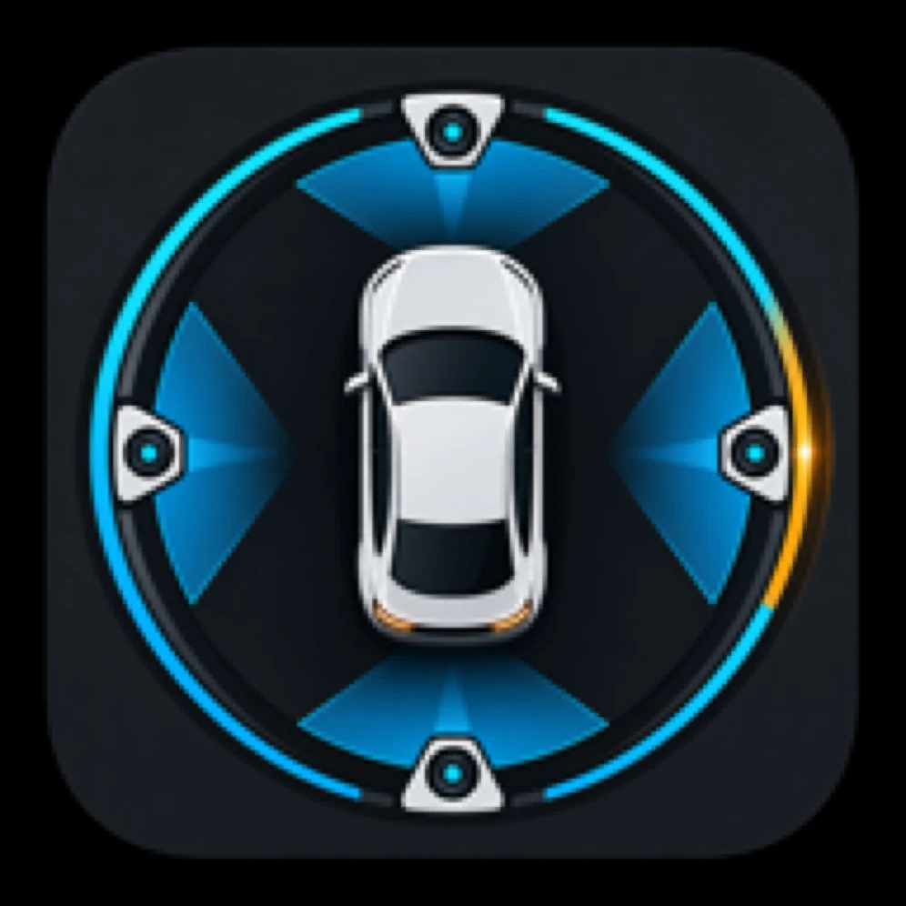

  

<h1 align="center">BladeWatch</h1>

Free, open-source dashcam and sentry mode app built specifically for BYD vehicles with DiLink v3. All data stays on your device — no cloud, no accounts, no subscriptions.

## Quick Start (Use Pre-built APK)

Download the latest APK from [GitHub Releases] and install it directly on your BYD head unit.

### 1. Prerequisites
- Ensure **Wireless ADB** is enabled on your device before launching the app.

### 2. Initial Configuration
1. **Authorize ADB:** On first launch, accept the ADB authentication prompt on your device screen.
2. **Background Persistence:** In Settings, ensure the **"Disable Autostart"** toggle is **unchecked**. This is critical for reliable background operation.

> ⚠️ **CRITICAL: Hard Reboot Required**
> After the first installation and initial run, you must hard reboot the device:
> Press and hold the **Volume Down** button for 5 seconds. Wait for the system to fully restart.
> This step is necessary to finalize the installation.

---

## Features

- **Optimized Recording Pipeline** — <28% CPU, ~150MB memory, <3s boot time
- **Proximity Recording (Market First)** — Uses BYD's 8 parking radar sensors to trigger recording only when objects approach. Configurable trigger levels, pre-event buffer, and 500ms debouncing.
- **Advanced Sentry Mode** — 24/7 surveillance with motion detection and AI object recognition
- **Real-time Performance Monitor** — CPU, GPU, memory usage, and battery voltage dashboard
- **ADB Shell Runner** — Built-in terminal for running commands, checking processes, and viewing logs
- **Recording Library** — Calendar view for browsing and managing recordings

### Zrok Tunnel (Recommended)
Free, open-source tunneling with no bandwidth limits at `https://<your-share>.share.zrok.io`. Best for video streaming. Do not share the invite token or public share link unless you intend to expose the car UI.

**Quick Zrok setup:**
1. Sign up at [zrok.io](https://zrok.io)
2. Get your invite token from email
3. Enter token in BladeWatch settings
4. Done — tunnel URL is auto-generated

> Should work on all BYD vehicles with DiLink v3 and panoramic camera system.

## Zrok Token Setup (Optional)

If you want to use Zrok tunneling for remote access, you need your own Zrok invite token:

1. Sign up at [zrok.io](https://zrok.io) and get your invite token from email.
2. Enter the token in the app: Daemons → Zrok settings.
3. If you are building from source, prefer the on-device settings flow instead of hardcoding the token into source.

## Privacy

- 100% local storage — all recordings saved on device
- No account required
- No cloud upload — remote viewing is direct via tunnels
- Open source — audit the code yourself

## Acknowledgments

- **Native Bangcle Crypto Engine** — Full Java port of BYD's proprietary white-box AES encryption, based on the reverse engineering work by [Niek/BYD-re](https://github.com/Niek/BYD-re) and [jkaberg/pyBYD](https://github.com/jkaberg/pyBYD). Zero new dependencies — uses the existing OkHttp stack and Java crypto libraries.
- **3D BYD Vehicle Models** — Vehicle Control page uses base models from [ddiaz-design's BYD collection on Sketchfab](https://sketchfab.com/ddiaz-design/collections/byd-base-models-5bf92ab5f2be4ff6be5c3ac49f7099f3).

## License

Open source under MIT License. Your data stays on your device.
